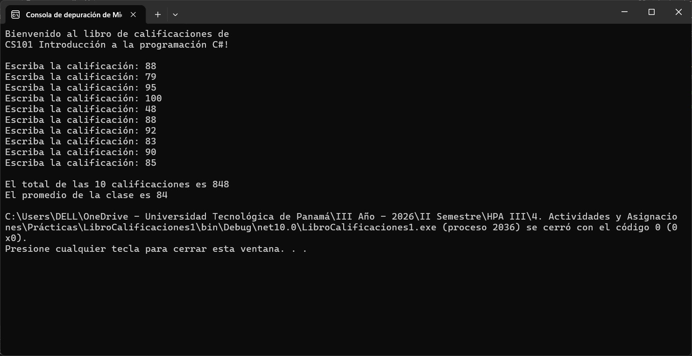
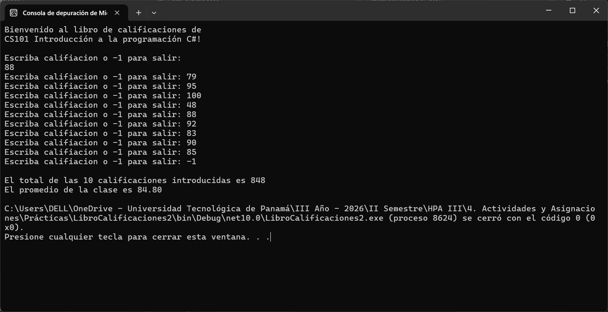

# 📚 Laboratorio: Libro de Calificaciones

## 📝 Descripción

Este repositorio contiene la solución al laboratorio práctico del documento **LibroCalificaciones**. El objetivo principal de este proyecto es demostrar los fundamentos de la Programación Orientada a Objetos (POO) a través del diseño y la evolución de una clase que gestiona las calificaciones de estudiantes.

El repositorio está dividido en dos proyectos independientes: **LibroCalificaciones1** y **LibroCalificaciones2**. La particularidad de este laboratorio es que **ambos programas utilizan exactamente el mismo código para la clase principal (`Program.cs`)** (basado en la página 3 / 126 del documento), pero se diferencian en la estructura y los miembros de sus respectivas clases de dominio (`Class1.cs` y `LibroCalificaciones.cs`). Esto demuestra cómo los cambios internos en una clase no afectan al programa cliente si se mantiene la misma interfaz pública.

## 🛠️ Tecnologías Utilizadas

* **Lenguaje:** C# 
* **Framework:** .NET 10.0
* **Entorno de Desarrollo (IDE):** Visual Studio

## 📂 Estructura del Repositorio

El código fuente está organizado de la siguiente manera:

```text
📦 jacu2006/LibroCalificaciones
 ┣ 📂 LibroCalificaciones1
 ┃ ┣ 📂 bin/Debug/net10.0
 ┃ ┣ 📂 obj
 ┃ ┣ 📜 Class1.cs                    # Implementación de la versión 1 de la clase
 ┃ ┣ 📜 LibroCalificaciones1.csproj  # Archivo de proyecto
 ┃ ┣ 📜 LibroCalificaciones1.slnx    # Solución de Visual Studio
 ┃ ┗ 📜 Program.cs                   # Método Main (Pág. 3 / 126)
 ┣ 📂 LibroCalificaciones2
 ┃ ┣ 📂 bin/Debug/net10.0
 ┃ ┣ 📂 obj
 ┃ ┣ 📜 LibroCalificaciones.cs       # Implementación de la versión 2 de la clase
 ┃ ┣ 📜 LibroCalificaciones2.csproj  # Archivo de proyecto
 ┃ ┣ 📜 LibroCalificaciones2.slnx    # Solución de Visual Studio
 ┃ ┗ 📜 Program.cs                   # Método Main (Idéntico al de la versión 1)
 ┣ 📂 assets
 ┃ ┣ 🖼️ ejecucion_proyecto1.png
 ┃ ┗ 🖼️ ejecucion_proyecto2.png
 ┗ 📜 README.md
```

## ⚙️ Diferencias entre los Proyectos

### 🔹 Proyecto 1: `LibroCalificaciones1`

Contiene la versión inicial de la clase (nombrada como `Class1.cs`). Se enfoca en la estructura básica, declaración de variables de instancia y métodos fundamentales para mostrar el mensaje de bienvenida al curso.

### 🔹 Proyecto 2: `LibroCalificaciones2`

Contiene una versión mejorada y expandida de la clase (`LibroCalificaciones.cs`). Aunque el archivo `Program.cs` que lo ejecuta es idéntico al del Proyecto 1, esta versión de la clase introduce nuevos conceptos (como constructores, validaciones mediante propiedades *get* y *set*, o manejo de parámetros más complejos) según las especificaciones del documento.

## 🚀 Compilación y Ejecución

Tienes dos opciones para ejecutar estos proyectos:

**Opción 1: Usando Visual Studio**
1. Abre el archivo de solución (`.slnx` o `.csproj`) de la carpeta que deseas probar (`LibroCalificaciones1` o `LibroCalificaciones2`) en Visual Studio.
2. Haz clic en el botón de **Iniciar** (o presiona `F5`) para compilar y ejecutar el proyecto.

**Opción 2: Usando la CLI de .NET**
1. Abre tu terminal o símbolo del sistema.
2. Navega al directorio del proyecto que deseas ejecutar:
   ```bash
   cd LibroCalificaciones1
   ```
3. Ejecuta el comando de .NET:
   ```bash
   dotnet run
   ```
4. Repite los pasos para la carpeta `LibroCalificaciones2`.

## 📸 Capturas de Ejecución

A continuación se muestran los resultados por consola al ejecutar ambos proyectos:

### Ejecución de LibroCalificaciones1

Aquí se observa la salida en consola utilizando la primera versión de la clase:



### Ejecución de LibroCalificaciones2

Aquí se observa la salida en consola utilizando la segunda versión de la clase, ejecutada por el mismo `Program.cs`:



## ✒️ Autor y Contexto
* **Nombre:** Javier Alberto Acuña Castro
* **Institución:** Universidad Tecnológica de Panamá (UTP) - Campus Víctor Levi Sasso
* **Facultad:** Facultad de Ingeniería en Sistemas Computacionales
* **Curso:** Herramientas de Programación Aplicada III
* **Grupo:** 1IL133
* **Instructor:** Ing. Irina Fong
* **Fecha de Entrega:** 21/09/2026

---

## 📖 Referencias
* Guía de laboratorio: *Capítulo 5 Instrucciones de Control - parte I.pdf* - Ing. Irina Fong.
